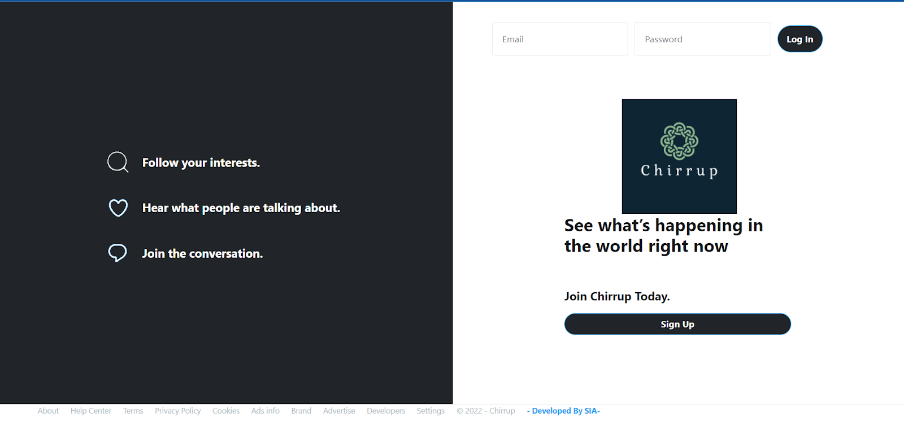
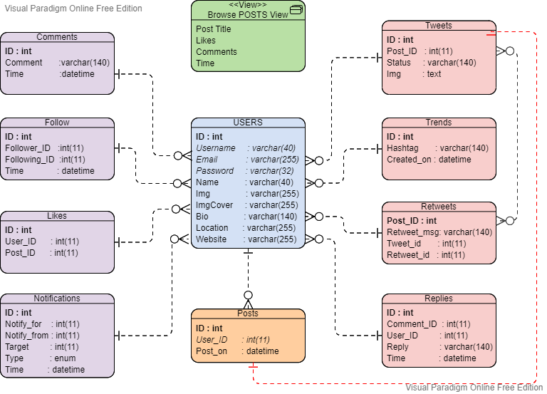

 <p align="center">
  
  
</p>


<h1 align="center">Welcome to CHIRRUP Web-App 👋</h1>
<p>
  
  <a href="to be added" target="_blank">
    
  </a>
  <a href="nonee" target="_blank">
    
  </a>
  </p>

  > Chirrup is a social media platform where people can connect to each other and post about their life.
It is a platform where people can post about both their professional and personal life and can connect with many people.
In this platform, users can also post about their achievements.


  ## APP PREVIEW

<p align="center">
  
  
 
</p>

  ## Install

```sh
XAMPP Server
```

## Usage

```sh
run APACHE 
run MySQL
```

## Run


 <div align="center"> 
   
</div>
  <br>

    
<div align="center"> 
  <table>
<tr align="center">

<td>

👤 **Akshat Sachan**

<p align="center">

</p>
<p align="center">
<a href = "https://github.com/cryptocoderas">
</a>
<a href = "https://www.linkedin.com/in/akshat-sachan-58b2921ab/">

</a>
</p>
</td>


<td>

👤 **Ishita Sharma**

<p align="center">

</p>
<p align="center">
<a href = "https://github.com/ishitasharma3101">
</a>
<a href = "https://www.linkedin.com/in/akshat-sachan-58b2921ab/">

</a>
</p>
</td>


</table>
</tr>
</div>
  <br>
  
  
<div align="center">
  
 </div>
 
## Show your support

Give a ⭐️ if you liked this project or it helped you!

## 📝 License


This project is [MIT](none) licensed.

## MIT License 

```

Copyright (c) 2021 AKSHAT SACHAN

Permission is hereby granted, free of charge, to any person obtaining a copy
of this software and associated documentation files (the "Software"), to deal
in the Software without restriction, including without limitation the rights
to use, copy, modify, merge, publish, distribute, sublicense, and/or sell
copies of the Software, and to permit persons to whom the Software is
furnished to do so, subject to the following conditions:

The above copyright notice and this permission notice shall be included in all
copies or substantial portions of the Software.

THE SOFTWARE IS PROVIDED "AS IS", WITHOUT WARRANTY OF ANY KIND, EXPRESS OR
IMPLIED, INCLUDING BUT NOT LIMITED TO THE WARRANTIES OF MERCHANTABILITY,
FITNESS FOR A PARTICULAR PURPOSE AND NONINFRINGEMENT. IN NO EVENT SHALL THE
AUTHORS OR COPYRIGHT HOLDERS BE LIABLE FOR ANY CLAIM, DAMAGES OR OTHER
LIABILITY, WHETHER IN AN ACTION OF CONTRACT, TORT OR OTHERWISE, ARISING FROM,
OUT OF OR IN CONNECTION WITH THE SOFTWARE OR THE USE OR OTHER DEALINGS IN THE
SOFTWARE.
```

